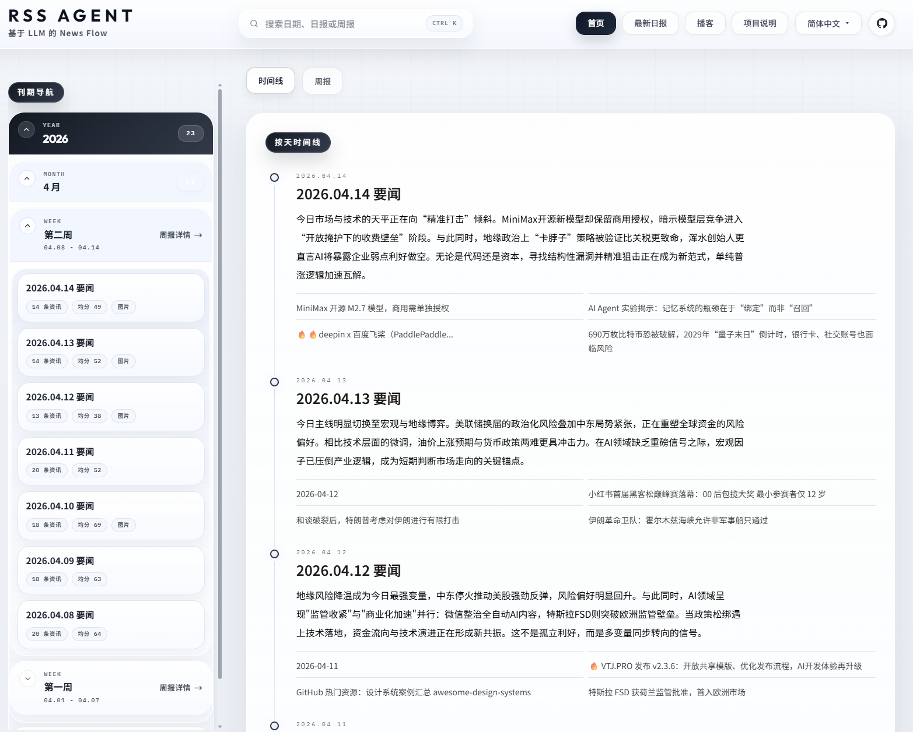
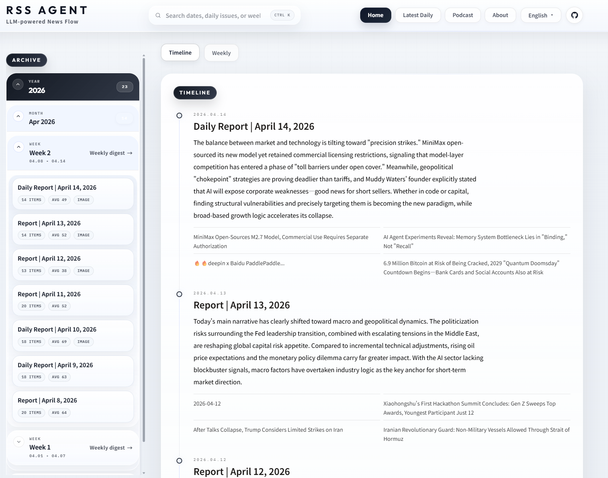
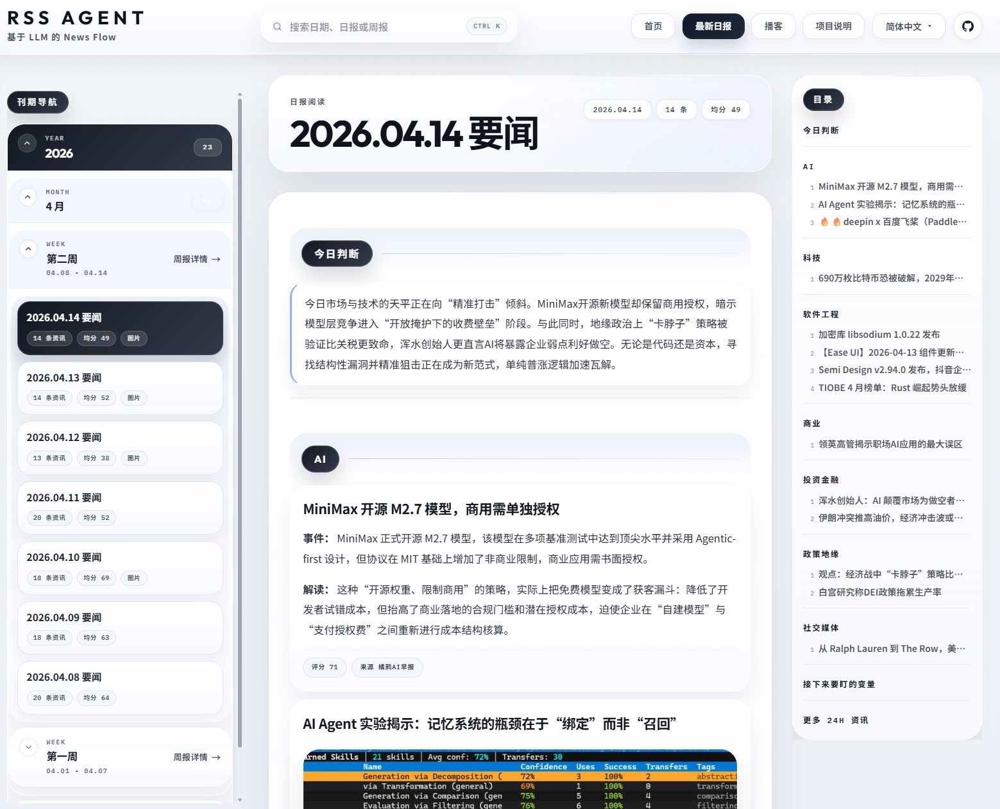
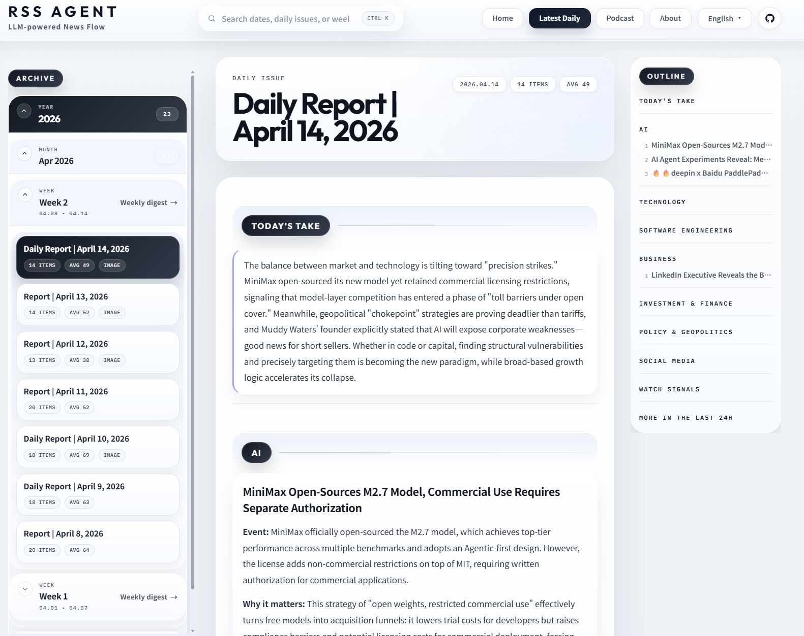
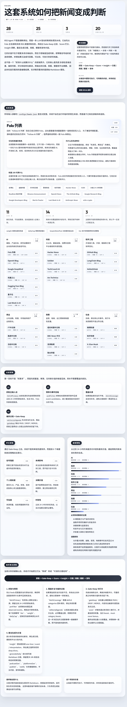
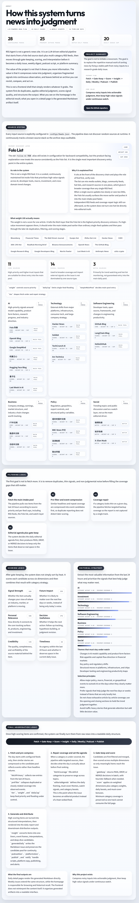
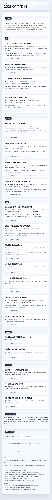
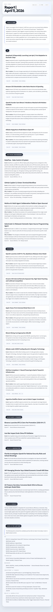
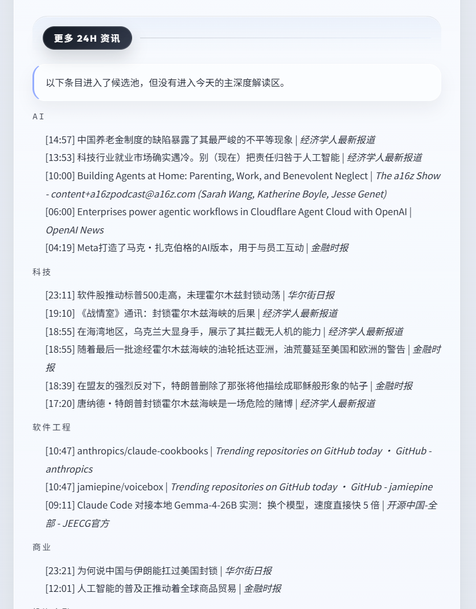
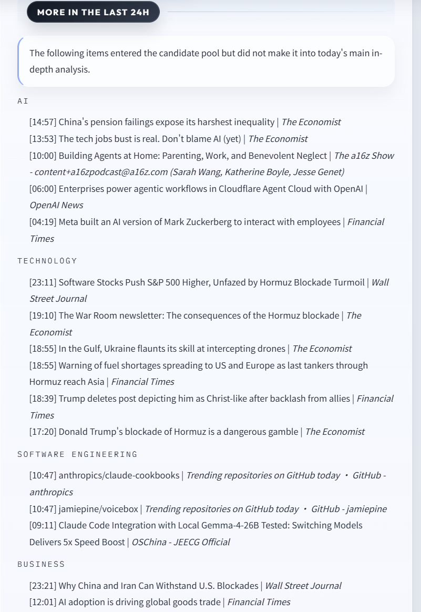

<div align="center">

# LLM News Flow

<p>
  <a href="./README.md">
    
  </a>
</p>

<p>
  <a href="https://rss-pub-agent.vercel.app">
    
  </a>
  <a href="https://github.com/jianjiachenghub/rss-pub-agent/actions/workflows/daily-pipeline.yml">
    
  </a>
  <a href="https://github.com/jianjiachenghub/rss-pub-agent/stargazers">
    
  </a>
  <a href="./LICENSE">
    
  </a>
</p>

<p>
  
  
  
  
</p>

<p>
  一个 AI 驱动的个人新闻编辑流水线：把海量资讯处理成日报、分发文案、播客脚本和静态站点。
</p>

</div>

## 界面预览

下面按页面展示中文与英文界面，左侧中文，右侧英文。点击缩略图可查看完整原图。

<table>
  <thead>
    <tr>
      <th>页面</th>
      <th>中文</th>
      <th>English</th>
    </tr>
  </thead>
  <tbody>
    <tr>
      <td><strong>首页</strong><br>Home</td>
      <td><a href="./docs/img/zh-home.png"></a></td>
      <td><a href="./docs/img/en-home.png"></a></td>
    </tr>
    <tr>
      <td><strong>日报页</strong><br>Daily News</td>
      <td><a href="./docs/img/zh-news.png"></a></td>
      <td><a href="./docs/img/en-news.png"></a></td>
    </tr>
    <tr>
      <td><strong>工作原理</strong><br>How It Works</td>
      <td align="center"><a href="./docs/img/zh-how.png"></a></td>
      <td align="center"><a href="./docs/img/en-how.png"></a></td>
    </tr>
    <tr>
      <td><strong>长文详情</strong><br>Full Article</td>
      <td align="center"><a href="./docs/img/zh-news-full.png"></a></td>
      <td align="center"><a href="./docs/img/en-news-full.png"></a></td>
    </tr>
    <tr>
      <td><strong>更多页</strong><br>More</td>
      <td><a href="./docs/img/zh-more.png"></a></td>
      <td><a href="./docs/img/en-more.png"></a></td>
    </tr>
  </tbody>
</table>

长页面在 README 里使用了缩略预览，点开图片即可查看完整长图。

## 项目概览

LLM News Flow 不是一个普通的 RSS 阅读器，而是一套自动化编辑部系统：

- 每天从 28 个 Folo / RSS feed source 抓取资讯
- 先压缩事件，再做编务判断、去噪和六维评分
- 输出正式日报、平台摘要、播客脚本和前端展示内容
- 通过 `content/` 目录把“内容生产”和“内容展示”解耦

它的核心目标不是“收集更多”，而是“把信息变成判断”。

## 目录

- [界面预览](#界面预览)
- [为什么做这个项目](#为什么做这个项目)
- [核心能力](#核心能力)
- [系统架构](#系统架构)
- [产出内容](#产出内容)
- [技术栈](#技术栈)
- [快速开始](#快速开始)
- [配置说明](#配置说明)
- [本地运行](#本地运行)
- [文档索引](#文档索引)
- [仓库结构](#仓库结构)
- [Roadmap](#roadmap)
- [参与贡献](#参与贡献)
- [许可证](#许可证)

## 为什么做这个项目

大多数信息工具解决的是“怎么把源订进来”，这个项目解决的是“怎么把源变成一份稳定输出”。

它主要针对四个现实问题：

- 输入太多，人工很难稳定扫完
- 热门内容不等于高价值内容
- AI 赛道很容易淹没政策、市场、软件工程和商业信号
- 日报、平台分发、播客和站点如果各自维护，会迅速碎片化

所以这里的核心不是 feed inbox，而是一条内容流水线。

## 核心能力

- `14 节点 LangGraph 管线`：从配置加载到发布和通知
- `Editorial Agenda`：先判断“今天该怎么讲”，再进入筛选和评分
- `覆盖度补抓取`：避免某个分类完全占满日报
- `多提供商 LLM 回退`：provider 失败时自动重试和降级
- `Resume-from-raw`：支持从 `content/<date>/raw/` 恢复
- `统一内容契约`：前端只消费 `content/`，不参与内容生成
- `多格式输出`：日报、brief、抖音、小红书、播客脚本一次生成

## 系统架构

```text
START
  -> loadConfig
  -> fetchPrimary
  -> preFilter
  -> fetchCoverage
  -> buildEditorialAgenda
  -> gateKeep
  -> score
  -> enrichSelected
  -> insight
  -> generateDaily
  -> podcastGen ----\
  -> platformsGen --+-> publish
  -> notify
  -> END
```

关键设计点：

- `fetchPrimary` 只抓主 `folo-list`，形成当天主输入快照
- `preFilter` 压缩事件并计算覆盖缺口
- `fetchCoverage` 对缺口分类做补抓取
- `buildEditorialAgenda` 决定当天叙事主线和分类 boost
- `generateDaily` 生成唯一的正式日报
- `podcastGen` 与 `platformsGen` 在日报生成后并行执行
- `publish` 统一负责落盘和更新 `content/index.json`

更详细说明见 [docs/ARCHITECTURE.md](./docs/ARCHITECTURE.md)。

## 产出内容

每次成功运行都会输出一份按日期归档的内容包：

```text
content/YYYY-MM-DD/
|- daily.md
|- meta.json
|- brief.md
|- douyin.md
|- xhs.md
|- podcast-script.md
`- raw/
```

| 文件 | 作用 |
|---|---|
| `daily.md` | 正式日报正文 |
| `meta.json` | 条目数、分类、平均分、是否有播客等元信息 |
| `brief.md` | 短摘要，适合通知和轻分发 |
| `douyin.md` | 抖音文案 |
| `xhs.md` | 小红书文案 |
| `podcast-script.md` | 播客脚本；音频上传依赖 TTS 和 R2 |
| `raw/` | 中间快照，用于恢复和调试，不给前端直接消费 |

周报目前不是独立文件，而是前端运行时基于日报动态聚合出来的视图。

## 技术栈

| 层 | 技术 |
|---|---|
| Pipeline 编排 | LangGraph.js + TypeScript |
| LLM 层 | zhipu / gemini / openai / deepseek / siliconflow |
| 数据抓取 | Folo API + RSSHub + rss-parser |
| 前端 | Next.js 16 + React 19 + Tailwind CSS 4 |
| 内容渲染 | react-markdown + remark-gfm |
| 存储 | Git 内容、`.runtime` 状态、Cloudflare R2 播客音频 |
| 部署 | GitHub Actions + Vercel |
| 通知 | 飞书 Webhook / Telegram Bot / 微信 Webhook |

## 快速开始

### 1. 克隆仓库

```bash
git clone https://github.com/jianjiachenghub/rss-pub-agent.git
cd rss-pub-agent
```

### 2. 安装依赖

```bash
cd scripts && npm install && cd ..
cd frontend && npm install && cd ..
```

### 3. 创建 `.env`

```bash
cp .env.example .env
```

至少配置一个 LLM provider：

```bash
LLM_PROVIDERS=zhipu,gemini,openai
ZHIPU_API_KEY=your_key_here
```

### 4. 运行 Pipeline

```bash
npm run graph
```

### 5. 启动前端

```bash
cd frontend
npm run dev
```

打开 [http://localhost:3000](http://localhost:3000)。

## 配置说明

项目主要由三个配置文件驱动：

| 文件 | 作用 |
|---|---|
| `configs/feeds.json` | 信源、分类、权重、限额和主池行为 |
| `configs/prompt.json` | 兴趣主题、评分权重、覆盖保障、编辑策略 |
| `configs/platforms.json` | 通知和分发渠道配置 |

常见环境变量：

| 变量 | 作用 |
|---|---|
| `FOLO_SESSION_TOKEN` | 主力 Folo 列表抓取 |
| `GEMINI_API_KEY` | Gemini fallback 与 TTS |
| `TELEGRAM_BOT_TOKEN`, `TELEGRAM_CHAT_ID` | Telegram 通知 |
| `FEISHU_WEBHOOK_URL` | 飞书通知 |
| `WECHAT_WEBHOOK_URL` | 微信通知 |
| `R2_ACCESS_KEY`, `R2_SECRET_KEY`, `R2_ACCOUNT_ID`, `R2_BUCKET`, `R2_PUBLIC_DOMAIN` | 播客音频上传 |
| `REPORT_BASE_URL` | 外部通知里的日报链接 |

## 本地运行

### Pipeline

仓库根目录：

```bash
npm run graph
npm run pipeline
```

或进入 `scripts/`：

```bash
cd scripts
npx tsx graph.ts
npx tsx graph.ts --date 2026-04-08
npx tsx graph.ts --resume-from-raw 2026-04-08
```

### 前端

```bash
cd frontend
npm run dev
npm run build
npm run lint
```

注意：

- 仓库根 `package.json` 只代理 pipeline 命令
- 前端命令需要在 `frontend/` 下执行

## 文档索引

如果你准备维护或扩展这个项目，建议从下面几份文档开始：

- [docs/README.md](./docs/README.md)：当前文档入口、阅读顺序、历史资料位置
- [docs/ARCHITECTURE.md](./docs/ARCHITECTURE.md)：当前生效的 pipeline、LLM 层、存储与发布路径
- [docs/CODEBASE.md](./docs/CODEBASE.md)：代码模块地图、关键方法说明、常见改动入口
- [frontend/README.md](./frontend/README.md)：Next.js 前端的路由、数据契约和调试方式

## 仓库结构

```text
rss-pub-agent/
|- configs/                 运行时配置
|- scripts/                 LangGraph 管线与核心业务逻辑
|- frontend/                Next.js 展示层
|- content/                 生成内容契约
|- .runtime/                运行时状态，如飞书投递记录
|- docs/                    架构文档、设计方案和归档
|- reports/                 历史兼容产物
`- .github/workflows/       自动化工作流
```

推荐阅读顺序：

1. [README.md](./README.md) 英文主入口
2. [docs/ARCHITECTURE.md](./docs/ARCHITECTURE.md)
3. [docs/CODEBASE.md](./docs/CODEBASE.md)
4. [frontend/README.md](./frontend/README.md)
5. [docs/README.md](./docs/README.md)

## Roadmap

- [ ] 收敛 `reports/` 这类历史兼容公开面
- [ ] 增强 provider 性能与运行指标可观测性
- [ ] 扩展英文产物与英文站点文案
- [ ] 优化开源贡献者与自托管使用体验

## 参与贡献

欢迎 issue 和 PR。

如果你准备改动这个项目，建议先注意：

- 除非你明确在更新生成产物，否则不要手改 `content/`
- 改 pipeline 行为前先读 [docs/ARCHITECTURE.md](./docs/ARCHITECTURE.md)
- 尽量按功能边界提交改动
- 修改 pipeline 逻辑时优先补 `scripts/` 下的测试

## 许可证

本项目使用 [MIT License](./LICENSE)。
