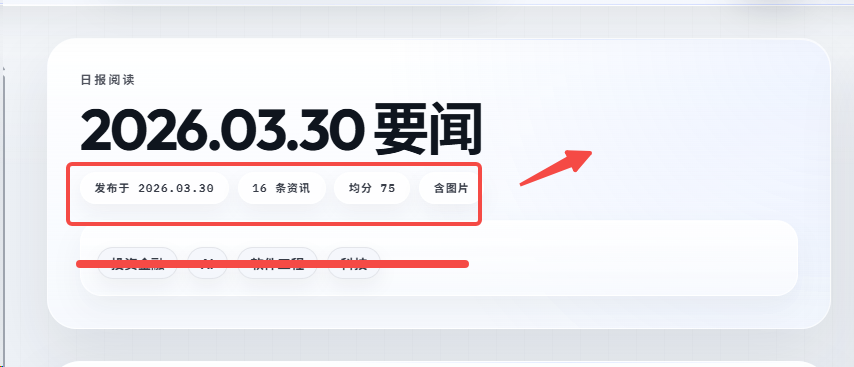

优化一下这个日报详情页的标题栏，然后把上面的那个分类标签给删掉 ，把概括的信息放到标题的右边就行 然后目录的分类栏字体再大一点 ，
目录目前缺少了以下几个模块：
1. 今日的判断
2. 后边的更多资讯
3. 接下来要盯的变量
更多资讯里面的排序有点问题，需要按照时间顺序排列：
1. 首先是分类
2. 分类内部应该是按时间顺序排列的

然后这个日报的标题命名有点问题哦，就是咱们今天抓的是昨天的，那这个标题应该是以昨天的日期为标题对吧？现在好像是以今天的日期为标题了